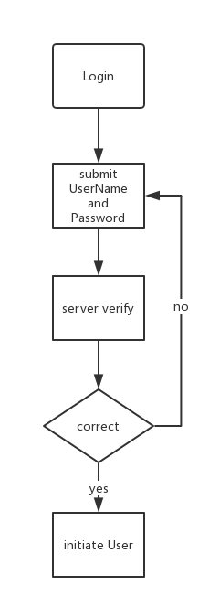
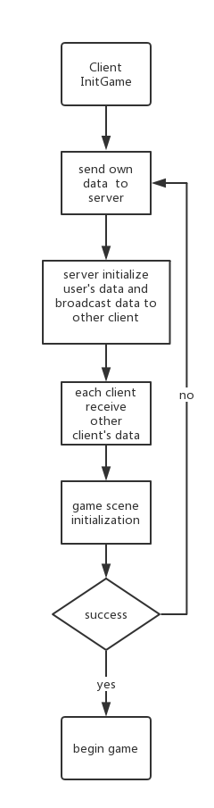

GameServer
===========
A game server based on [Leaf framework](https://github.com/name5566/leaf).

## Brief
This gameServer is a server for a car racing game,which client is implemented by Unity3D&C#,gameServer is implemented 
by golang,and mongodb.

## Procedure

### Login

Just a simple authorization

### InitGame

Connect to game server and initialize client game scene

### Game Synchronization

An efficient synchronization mechanism

## Reference
[leaf game server](https://github.com/name5566/leaf)

Licensing
--------

Leaf server is licensed under the Apache License, Version 2.0. See [LICENSE](https://github.com/name5566/leafserver/blob/master/LICENSE) for the full license text.
