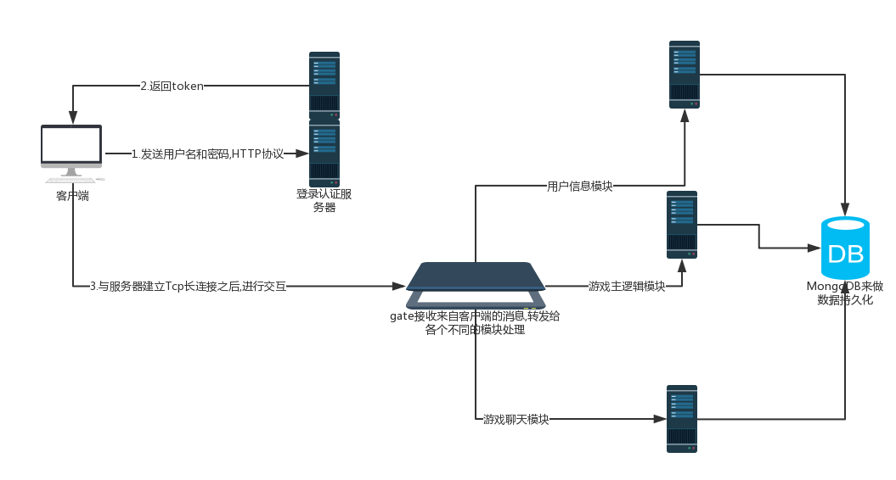

# 赛车游戏服务器(GameServer)
> 赛车游戏服务器端,golang语言实现

## 简介

多人赛车游戏服务器,基于开源[Leaf](https://github.com/name5566/leaf)游戏服务器框架的开发.该项目采用golang语言进行开发,利用了golang优秀并发性.

该游戏客户端采用Unity3D +C#开发,服务器端最终部署在阿里云上面,是一个个人的学习项目.

## 项目架构

## 项目技术

+ leaf开源框架,其中主要内核实现为chanRPC,基于golang channel的RPC模块间通信机制
+ 客户端与服务器交互采用json消息格式,易于扩展.
+ 游戏服务器使用了模块机制,不同的模块运行在不同的goroutine中,模块之间的通信采用chanRPC
+ 游戏服务器端中,用户实时的数据保存在内存中,保证交互的实时性,其他用户的基本资料保存使用mongoDB进行数据的持久化
+ 轻量级日志功能,可以记录服务器中的相关信息

## 支持功能
+ 用户登录注册认证
+ 游戏中添加好友功能,与好友聊天功能
+ 多人在线匹配,多人实时赛车竞赛
+ 个人资料信息的数据持久化

## 实现方案
### 登录认证模块(登录,注册,退出)
+ 客户端将相应的认证信息发送到登录认证模块
+ 登录认证模块通过与MongoDB数据库的交互进行认证

+ @TODO MongoDB存储密码时,进行SHA或者MD5的单项哈希存储密码,增加系统的安全性

### 游戏主逻辑模块
+ 游戏核心多人赛车竞赛,采用 __帧同步方案__ 来实现游戏数据的同步

### 游戏聊天模块
+ 服务器主要负责转发客户端到客户端之间的信息
+ @TODO 转发信息时,加密信息,或者过滤敏感信息

## 参考

[leaf服务器文档](https://github.com/name5566/leaf/blob/master/TUTORIAL_ZH.md)

