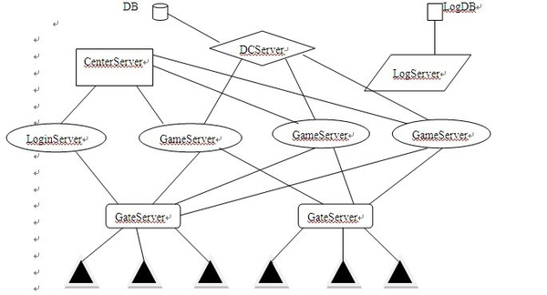

# 简介

## leaf服务器架构

通常游戏服务器开发采用分布式架构,即服务器整体被划分成不同的模块,
各个模块承担不同的功能,模块之间采用TCP进行交互,单点故障不会导致
服务器整体奔溃,leaf采用一体式的游戏服务器架构,模块之间采用chanRPC
进行交互,是一种简易高效的服务器.

与一些Web服务器不同,Leaf运行的大部分数据,在内存中,保证了实时的交互性,
采用mongodb是为了做一些持久化的数据,比如说登录认证等.

以上是比较常见的结构，客户端登录的时候，连接GateServer，然后由GateServer去连接LoginServer进行登录。
登录后通过CenterServer转发到GameServer（GameServer即是服务器大区）。而其中的DCServer，主要的功能是
缓存玩家角色数据，保证角色数据能快速的读取和保存。LogServer便是保存日志的了。

